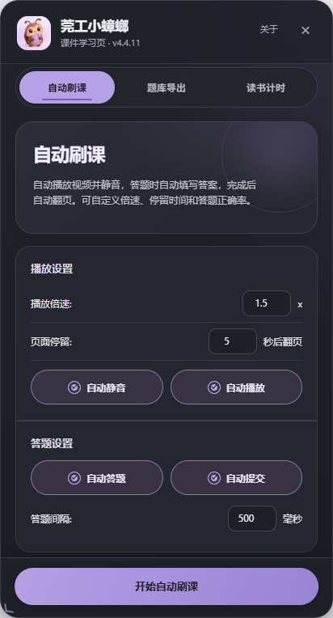

# 莞工小蟑螂1006

## 当前版本：v4.4.11

优学院学习辅助用户脚本，支持东莞理工学院优学院与标准优学院页面。

### 当前功能

- 课件目录预读与全课页数进度，显示当前页签标题。
- 自动播放、计时、翻页确认和运行日志；页面变化稳定确认后才计入进度。
- 手动定位到平台标记的未完成页；无法可靠定位时会提示。
- 课件题库与训练题库导出，提供 JSON 文件。
- 多组练习分组处理；填空、简答控件无法确认填写时会停在当前页。
- 浅色/暗色界面、窄屏布局、可调节面板和读书计时。

### 安装

1. 在 Chrome、Edge 或 Firefox 安装 Tampermonkey（篡改猴）。
2. 打开本目录的 `莞工小蟑螂-优学院全能助手.user.js` 并确认安装；也可以在 Tampermonkey 新建脚本后粘贴文件内容并保存。
3. 登录优学院，进入课程学习页，点击右侧小蟑螂按钮。
4. 具体功能步骤见本目录的 `README-项目说明.md`。

### 截图预览

| 自动刷课 | 题库导出 | 读书计时 |
|---|---|---|
|  |  |  |

| 暗色模式 | 窄屏布局 | 手动定位 |
|---|---|---|
|  |  |  |

### 版本与验收

- 全部版本更新记录：`CHANGELOG.md`。
- 现有安装脚本与更新日志索引：`版本索引.md`。
- 当前版验收记录：`验收报告-v4.4.11.md`（本地回归 62/62 通过）。
- 可安装历史脚本位于 `历史版本/`。

请遵守学校课程与测验规定，仅在允许的学习练习场景使用自动化功能。
